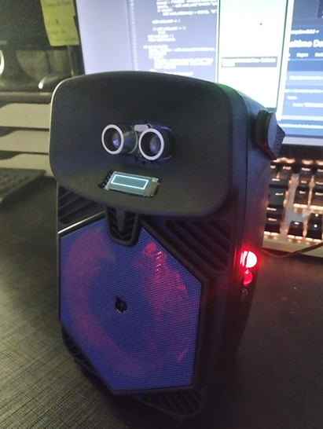
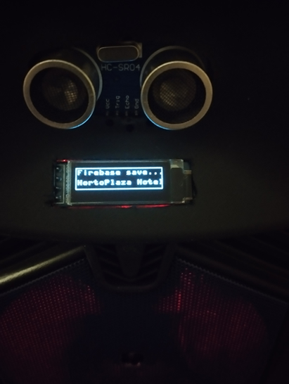
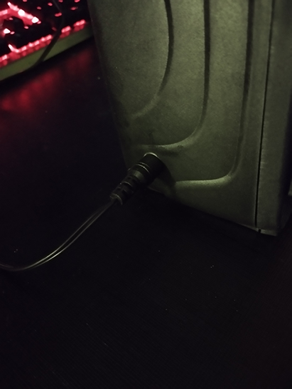
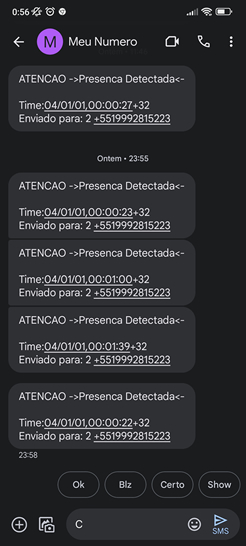
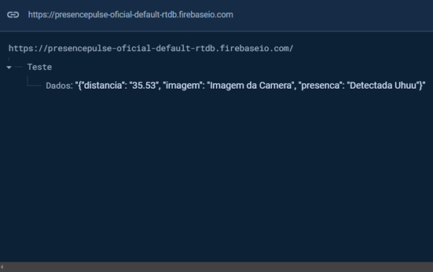
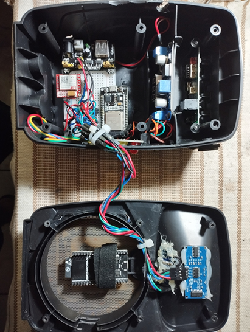
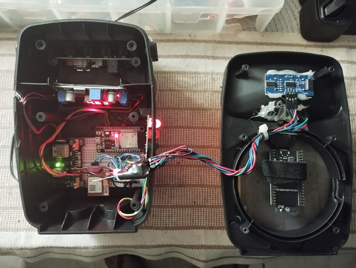
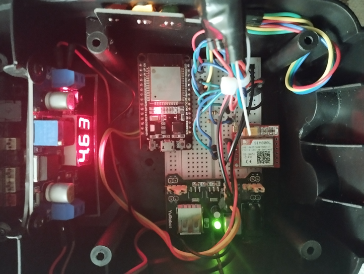
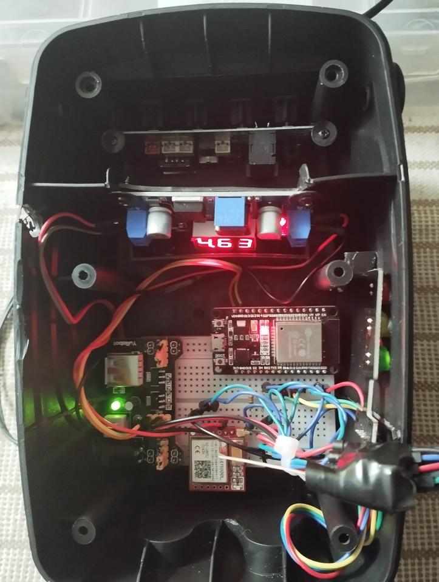

# Presence Pulse

## Descrição
"Presence Pulse" é um inovador sistema IoT destinado a melhorar o atendimento em estabelecimentos com pontos de serviço fixos, como hotéis. Ele integra sensores de proximidade, um módulo GSM e um microcontrolador ESP32 para notificar os recepcionistas sobre a presença de visitantes na área de recepção, otimizando assim o atendimento ao cliente.

## Funcionalidades
- **Detecção de Presença**: Utiliza sensores de proximidade para identificar a presença de visitantes na recepção.
- **Notificação de Recepcionistas**: Envia notificações via SMS ou chamadas através de um módulo GSM para o celular do recepcionista.
- **Programação Flexível**: Programado em MicroPython, o sistema oferece fácil adaptação e modificação para diversos cenários.

## Processo de Execução
1. **Inicialização do Protótipo**: Ao ligar, o ESP32 carrega os dados em memória.
2. **Execução do Boot.py**: Inicia automaticamente com `boot.py`, estabelecendo `__main__` como ponto de entrada.
3. **Carregamento do Sistema**: `main()` carrega o sistema e seus módulos.
4. **Loop Principal**: Um loop `while True` em `execute()` mantém o sistema operacional.
   - **Classe Core**: Instanciação da `SemafaroIoT`, gerenciando os módulos, incluindo `GSMSim800lMsg`.
   - **Medição de Distância**: Cálculo da distância via sensor ultrassônico.
   - **Verificação de Presença**: Se a distância for ≤ 200 cm, ativa o modo de notificação.
5. **Ativação da Notificação**: Com a presença detectada, `GSMSim800lMsg` envia notificações ao recepcionista.
6. **Registro no Firebase**: Dados de presença registrados no Firebase usando `ufirebase`.
7. **Retorno ao Loop**: Após a notificação e registro dos dados, o sistema retorna ao início do loop para novo monitoramento.

## Videos do Projeto
   

## Imagens do Protótipo
- Presence Pulse Protótipo Final v1.0.1 
##   [View](https://github.com/gbyteinfo/Micropython-Esp32-HCSR04-Sim800L/blob/develop/imgs_git/presence_pulse.jpg)

- Presence Pulse mostrando o OLED Display envio ao Firebase
##   [View](https://github.com/gbyteinfo/Micropython-Esp32-HCSR04-Sim800L/blob/develop/imgs_git/firebase_envio.jpg)

- Presence Pulse Conector para alimentação de 12V - 1.5ma
##   [View](https://github.com/gbyteinfo/Micropython-Esp32-HCSR04-Sim800L/blob/develop/imgs_git/carregador_p4)

- Presence Pulse mensagens SMS recebidas enviadas por GSM com SIM800L + Chip da TIM
##   [View](https://github.com/gbyteinfo/Micropython-Esp32-HCSR04-Sim800L/blob/develop/imgs_git/SMS-Recebido.jpg)

- Presence Pulse Realtime database no-sql Firebase, Estrutura json enviado pela ESP32 para armazenar as informações
##   [View](https://github.com/gbyteinfo/Micropython-Esp32-HCSR04-Sim800L/blob/develop/imgs_git/firebase_structure.jpg)

- Presence Pulse Protótipo aberto visto sem estar ligado
##   [View](https://github.com/gbyteinfo/Micropython-Esp32-HCSR04-Sim800L/blob/develop/imgs_git/presence_pulse_aberto1.jpg)

- Presence Pulse Protótipo aberto visto ligado e funcionando todos os modulos
##   [View](https://github.com/gbyteinfo/Micropython-Esp32-HCSR04-Sim800L/blob/develop/imgs_git/presence_pulse_aberto2.jpg)

- Presence Pulse Protótipo aberto visto ligado e funcionando todos os modulos na parte mais interna
##   [View](https://github.com/gbyteinfo/Micropython-Esp32-HCSR04-Sim800L/blob/develop/imgs_git/presence_pulse_aberto3.jpg)

- Presence Pulse Protótipo aberto visto ligado e funcionando todos os modulos na partemenos interna
##   [View](https://github.com/gbyteinfo/Micropython-Esp32-HCSR04-Sim800L/blob/develop/imgs_git/presence_pulse_aberto4.jpg)

## Componentes
- ESP32 WRoom Devkit v1
- Sensor Ultrassônico HC-SR04
- Display OLED 0.91 - I2C 128x32
- Semáforo RGY LED
- GSM Sim800L
- Fonte Ajustável Protoboard 3.3v / 5v
- Regulador de Tensão Step-Down LM2596 DC-DC

## Instalação
Detalhes sobre a montagem do protótipo e esquemático serão disponibilizados em breve.

## Requisitos
- MicroPython v1.20.0 para ESP32: [Download](https://micropython.org/download/ESP32_GENERIC/)
- IDE Thonny para execução e manutenção dos arquivos Python: [Download](https://thonny.org/)
- Biblioteca `ssd1306` para o Display OLED: [GitHub](https://github.com/stlehmann/micropython-ssd1306/blob/master/ssd1306.py)
- Biblioteca `ufirebase` para integração com Firebase: [GitHub](https://github.com/ckoever/micropython-firebase-realtime-database)

## Contribuição
Colaboração com Francisco e suporte do Profº Alan Gonçalves, Unimetrocamp. Sugestões e contribuições são bem-vindas.

## Licença
Este projeto está sob a Licença MIT. [Incluir detalhes da licença].

## Contato
Gbyteinfo - Informação e Tecnologia
[Website](https://gbyteinfo.com.br)
[Email](mailto:gbyteinfohorto@gmail.com)
"""
